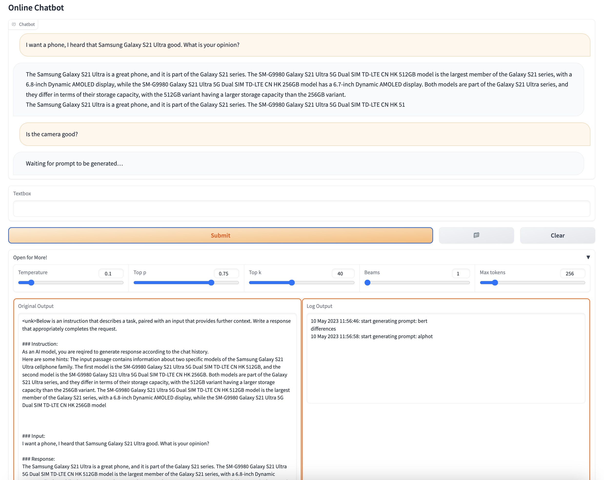
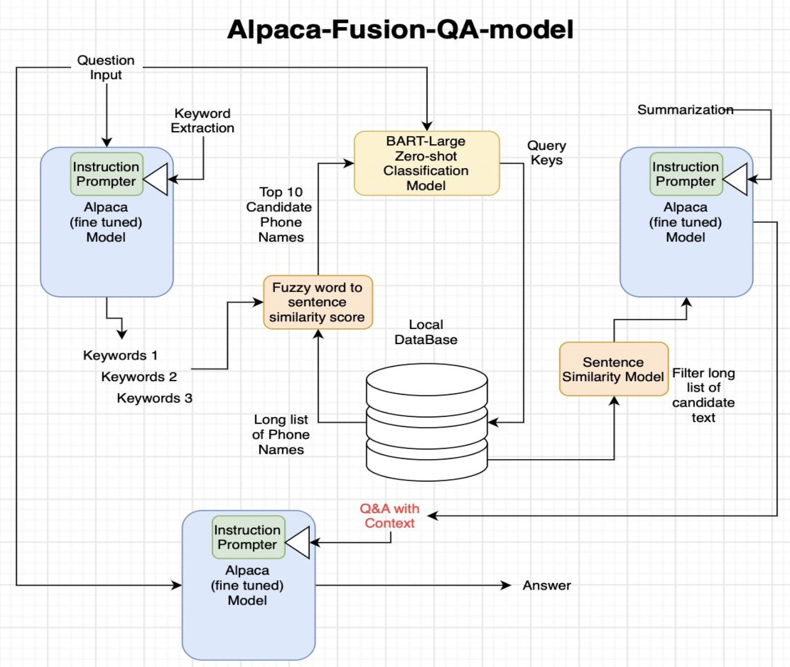
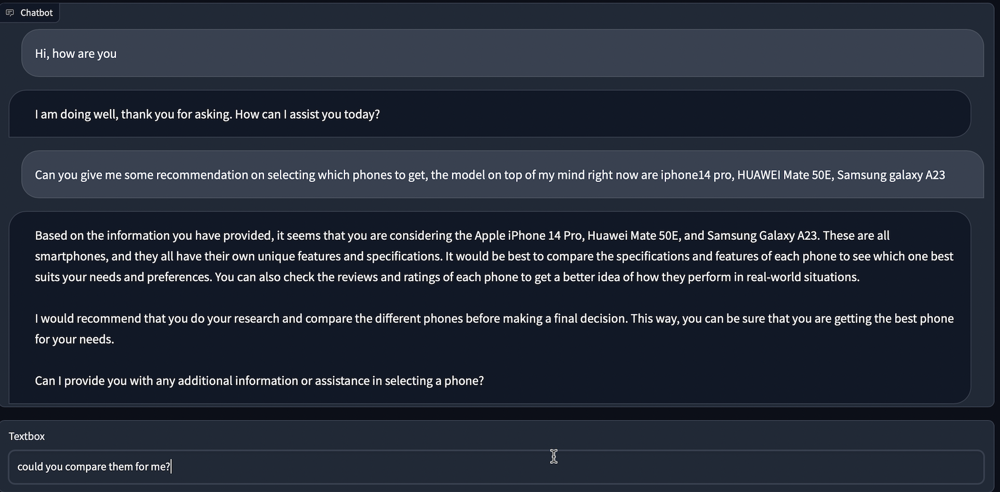
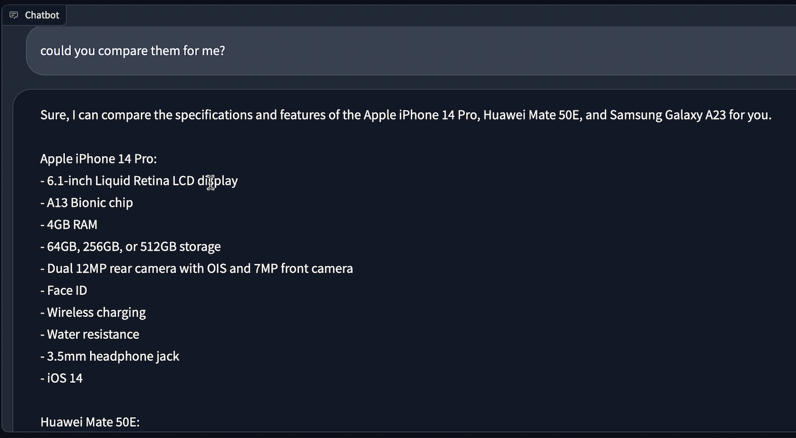
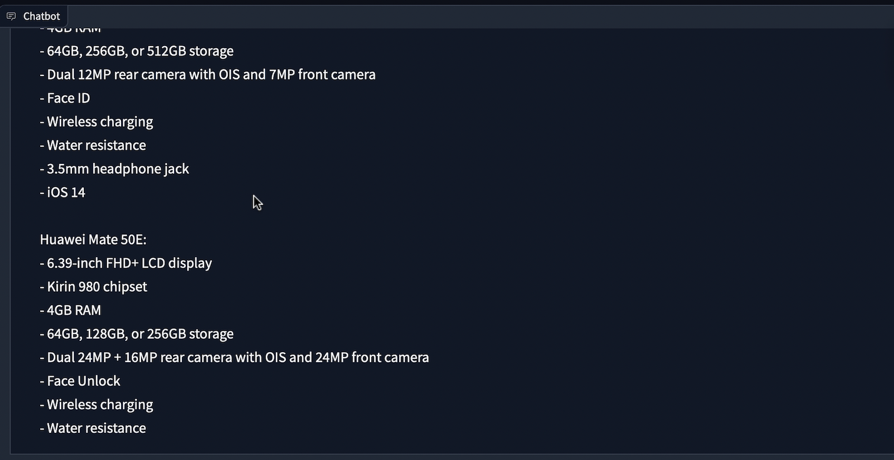

# Alpaca LLM based Cellphone Sales Chatbot
Domain-specific AI chatbot built with a combinations of Alpaca-lora and other classical NLP models such as BERT for cellphone sales relevant Q&amp;A.

Stanford Alpaca LLM(Large Language Model):https://crfm.stanford.edu/2023/03/13/alpaca.html

Implementation reference: https://github.com/tloen/alpaca-lora

## File Structure

```
```

* `chatbot.py` runs our finalized model with web UI 
* ``


## Install Dependencies

```
pip install -r requirements.txt
```

## Chatbot Web UI 

We utilize Gradio to construct a web user interface. Simply execute:

```shell
python chatbot.py
```

Optional parameters:

- `--concurrency_count <int>`: Set the concurrency count for the chatbot (default: 3).
- `--server_name <str>`: Specify the server name for Gradio (default: "0.0.0.0").
- `--server_port <int>`: Define the server port for Gradio. If not provided, Gradio will choose an available port starting from 7860.
- `--share`: Enable Gradio's sharing service (default: False).



## Alpaca-Hotpot Pipeline

Combining Alpaca-Lora LLM with other classical NLP models for QA task: Alpaca-Hotpot(Alpaca-Fusion)

 

### Walk-through of Alpaca-Hotpot pipelines

Question: **How do the camera capabilities of the Apple iPhone 12,Samsung Galaxy S21, and Xiaomi Mi 11 compare?**

Answer with **step-by-step** print outs: 

```
------------------------------------------------
Step 1: Alpaca extract name tokens

>>>>> Instruction:
 Ignore the input. Extract all phone model names from the input sentence. Append and prepend '%%%' symbols to each phone model name.

>>>>> Input:
 How do the camera capabilities of the Apple iPhone 12,Samsung Galaxy S21, and Xiaomi Mi 11 compare?

Generating ......

<<<<< Output:
 %%Apple iPhone 12%%,%%Samsung Galaxy S21%%,%%Xiaomi Mi 11%%

------------------------------------------------
Using regex to tokenize:
['Xiaomi Mi 11', 'Samsung Galaxy S21', 'Apple iPhone 12']
------------------------------------------------

Step 2: Zero-shot BART classifier extract name keys

Extracted Model Name:  Xiaomi Mi 11
Extracted Model Name:  Samsung Galaxy S21
Extracted Model Name:  iPhone 12
------------------------------------------------


------------------------------------------------
Querying local DataBase ......
Model Name Family:  iPhone 12
100%|██████████| 158/158 [00:01<00:00, 87.91it/s]
100%|██████████| 159/159 [00:01<00:00, 96.47it/s]
100%|██████████| 158/158 [00:01<00:00, 96.31it/s]
Model Name Family:  Xiaomi Mi 11
100%|██████████| 145/145 [00:01<00:00, 91.49it/s]
100%|██████████| 145/145 [00:01<00:00, 93.96it/s]
100%|██████████| 150/150 [00:01<00:00, 94.48it/s]
Model Name Family:  Samsung Galaxy S21
100%|██████████| 166/166 [00:01<00:00, 89.09it/s]
100%|██████████| 166/166 [00:01<00:00, 94.32it/s]
100%|██████████| 173/173 [00:01<00:00, 94.69it/s]
------------------------------------------------
The iPhone 12 Mini 5G A2400 Dual SIM TD-LTE CN 128GB / A2401 is the most affordable variant of the iPhone 12 Mini for mainland China, Hong Kong and Macao. It features a Super Retina XDR AMOLED display protected by Ceramic Shield, 12 + 12 MP wide-angle rear cameras and 12 MP TrueDepth front camera. It also has HDR photo, Slow motion video, Burst mode, Touch focus, Panorama Photo, Face detection, Face tagging, Smile detection and 12.2 MP camera. The iPhone 12 Mini 5G A2400 Dual SIM TD-LTE CN 64GB / A2401 is the most affordable variant of the iPhone 12 Mini for mainland China, Hong Kong and Macao. It features a Super Retina XDR AMOLED display protected by Ceramic Shield, 12 + 12 MP wide-angle rear cameras and 12 MP TrueDepth front camera

Xiaomi Mi 11 Youth 5G Premium Edition Dual SIM TD-LTE CN 256GB M2101K9C is a Chinese variant of Mi11 Lite 5G smartphone with 256 GB UFS 2.2 ROM, 8 GiB LP-DDR4X RAM. Xiaomi Mi 11 Youth 5G Premium Edition Dual SIM TD-LTE CN 128GB M2101K9C is a Chinese variant of Mi11 Lite 5G smartphone with 128 GB UFS 2.2 ROM, 8 GiB LP-DDR4X RAM. Xiaomi Mi 11 Pro 5G Premium Edition Dual SIM TD-LTE CN 256GB M2102K1AC is a Chinese variant of Mi11 Pro 5G smartphone with 256 GB UFS 2.2 ROM, 8 GiB LP-DDR4X RAM.

The Samsung SM-G9960 Galaxy S21+ 5G Dual SIM TD-LTE CN HK 256GB is a powerful cellphone with a 12.2 MP camera, Samsung ISOCELL Plus S5K2LD camera module, and an adaptive display with support for 10 Hz to 120 Hz at Quad HD+ quality. It also has dual nano-SIM slots and 128 GB of storage. The Samsung SM-G9960 Galaxy S21+ 5G Dual SIM TD-LTE CN HK 128GB is a powerful cellphone with a 12.2 MP camera, Samsung ISOCELL Plus S5K2LD camera module, and an adaptive display with support for 10 Hz to 120 Hz at Quad HD+ quality. It also has dual nano-SIM slots and 128 GB of storage. The Samsung SM-G9980 Galaxy S21 Ultra 5G Dual SIM TD-LTE C


------------------------------------------------
................................................
Back to the original question >>>>>> 
------------------------------------------------
Question:
  How do the camera capabilities of the Apple iPhone 12,Samsung Galaxy S21, and Xiaomi Mi 11 compare?


Answer:
 The camera capabilities of the Apple iPhone 12, Samsung Galaxy S21, and Xiaomi Mi 11 are similar. The iPhone 12 has a 12 MP wide-angle rear camera and a 12 MP TrueDepth front camera. The Galaxy S21 has a 12 MP wide-angle rear camera and a 12 MP TrueDepth front camera. The Mi 11 has a 12 MP wide-angle rear camera and a 12 MP TrueDepth front camera.
```


Alpaca-Hotpot is wrapped as a class defined in [alpaca_hotpot_qa.py](https://github.com/zht043/cell-sales-chatbot/blob/main/alpaca_hotpot_qa.py), example usage can be found in this [alpaca-hotpot-qa-example-usages.ipynb](https://github.com/zht043/cell-sales-chatbot/blob/main/alpaca-hotpot-qa-example-usages.ipynb).

Example:

```python
from alpaca_hotpot_qa import AlpacaHotPotQA
alphot_qa_inference = AlpacaHotPotQA(device, alp_model, tokenizer, phonedb_data, name_map)

question = '''\
"How do the camera capabilities of the Apple iPhone 12, Samsung Galaxy S21, and Xiaomi Mi 11 compare?"
'''
answer = alphot_qa_inference.inference(question)
```


## Additional Demo Screenshots






