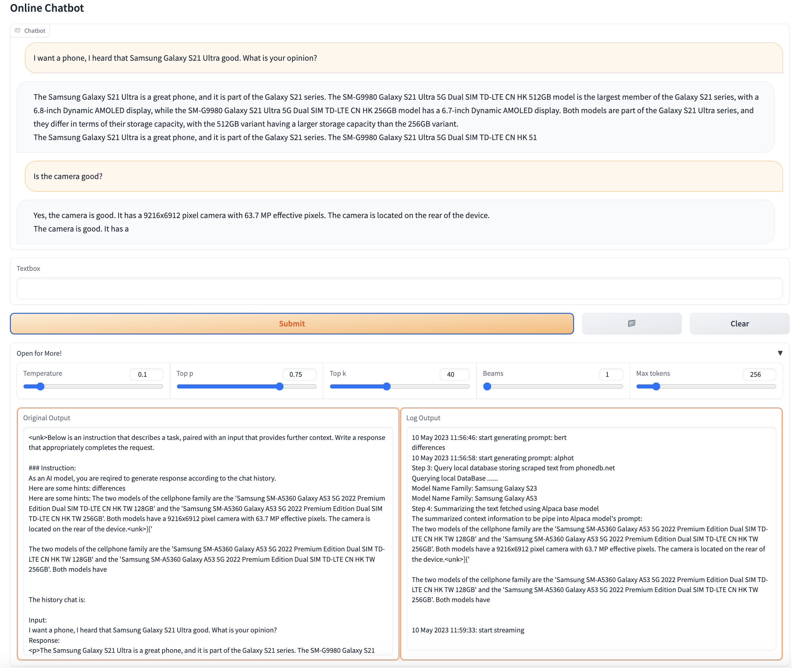

# cell-sales-chatbot
Domain-specific AI chatbot built with a combinations of Alpaca-lora and other small NLP models for cellphone sales relevant Q&amp;A

```
pip install -r requirements.txt
```

## Chatbot Web Interface

We utilize Gradio to construct a web interface. Simply execute with `python chatbot.py`.

Optional parameters:

- `--concurrency_count <int>`: Set the concurrency count for the chatbot (default: 3).
- `--server_name <str>`: Specify the server name for Gradio (default: "0.0.0.0").
- `--server_port <int>`: Define the server port for Gradio. If not provided, Gradio will choose an available port starting from 7860.
- `--share`: Enable Gradio's sharing service (default: False).




